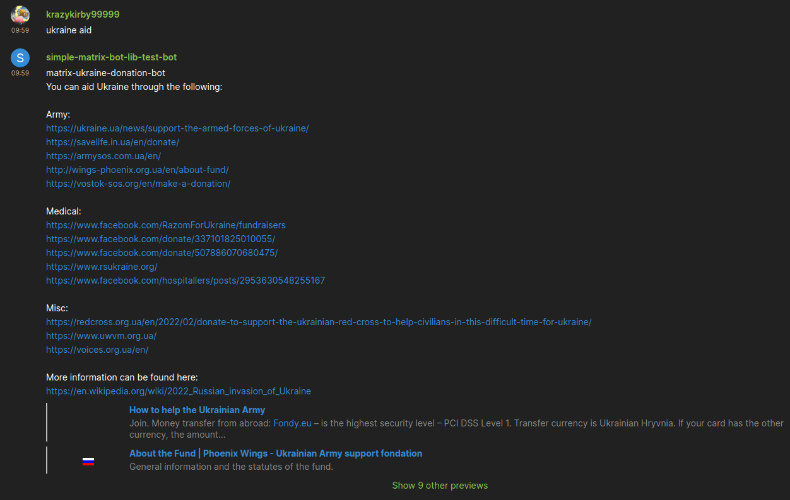

# matrix-ukraine-donation-bot

A Matrix chat bot to send donation links to aid Ukraine in the 2022 Russian invasion of Ukraine.

Made with [](https://github.com/i10b/simplematrixbotlib)

## Setup
Install Python 3.8 or higher

Install python-poetry
```bash
python -m pip install poetry
```

Clone Repository
```bash
git clone https://github.com/KrazyKirby99999/matrix-ukraine-donation-bot.git
```

Install Dependencies
```bash
cd matrix-ukraine-donation-bot
python -m poetry install
```

## Usage:
Set environment variables
```bash
HOMESERVER=https://matrix.org
USERNAME=matrix-ukraine-donation-bot
PASSWORD=password # or ACCESS_TOKEN=syt_...
```

Run main.py
```bash
python -m poetry run python main.py
```

## Example:

